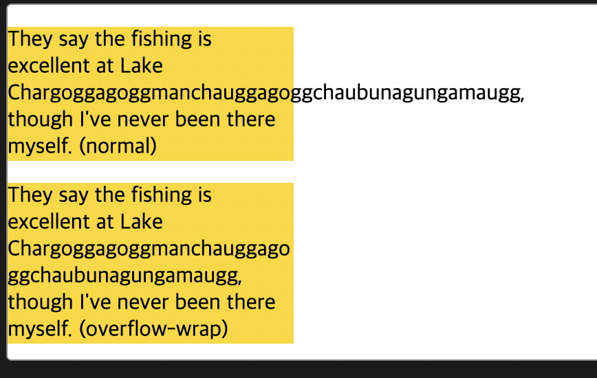

# overflow-wrap

어떤 문자가 내용 칸 밖으로 넘치지 않게 브라우저가 단어 마디 안에 줄을 바꿔야 할 것인지 아닌지를 정할 때 사용된다.

## 값

- `normal`
  줄이 오직 보통의 줄 바꿈 지점에서만 줄을 바꾼다.
- `break-word`
  보통 안 바꿔지는 단어들을 한 줄에서 대신 줄을 바꿀만한 지점이 없을 시 임의의 지점에서 줄을 바꾼다.

**예시**

