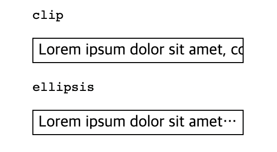

# text-overflow

white-space를 이용해 줄 바꿈을 하지 않을 때 넘치는 텍스트 처리를 어떻게 할 것인지 처리하는 속성

**overflow 속성이 hidden, scroll, auto이면서white-space:nowrap 일 경우 일때만 적용됨**

## 값

- `clip`
  넘치는 텍스트를 자른다.
- `ellipsis`
  잘라지는 부분에 ...가 생기면서 잘린 텍스트가 있다고 표시된다.

**예시**

