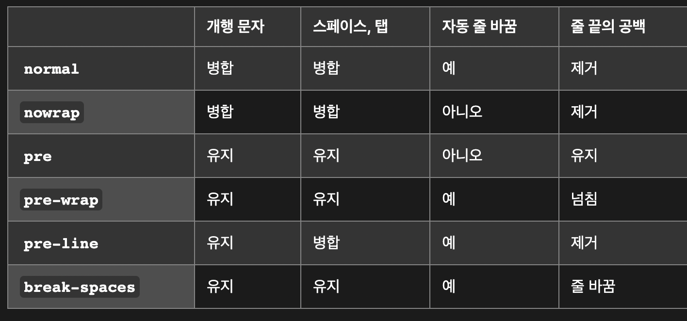

# white-space

요소가 공백 문자를 처리하는 법을 지정합니다.

## 값

- `normal`
  **연속 공백을 하나로 합침.** 개행 문자도 다른 공백 문자와 동일하게 처리함. 한 줄이 너무 길어서 넘칠 경우 자동으로 줄을 바꿔준다.
- `nowrap`
  **연속 공백을 하나로 합침.** 줄 바꿈은 ` `요소 에서만 일어난다.
- `pre`
  **연속 공백 유지.** 줄 바꿈은 개행 문자와 ` `요소에서만 일어난다.
- `pre-wrap`
  **연속 공백 유지.** 줄 바꿈은 개행 문자와 ` ` 요소에서 일어나며, 한 줄이 너무 길어서 넘칠 경우 자동으로 줄을 바꿔준다.
- `pre-line`
  **연속 공백을 하나로 합침**. 줄바꿈은 개행 문자와 ` ` 요소에서 일어나며, 한 줄이 너무 길어서 넘칠 경우 자동으로 줄을 바꿔준다.
- `break-spaces`
  - 연속 공백이 줄의 끝에 위치하더라도 공간을 차지한다.
  - 연속 공백의 중간과 끝에서도 자동으로 줄을 바꿀 수 있다.
  - 유지한 연속 공백은 `pre-wrap`과 달리 요소 바깥으로 넘치지 않으며, 공간도 차지하므로 박스의 본질 크기`(min-content, max-content)`에 영향을 준다.

**요약**

